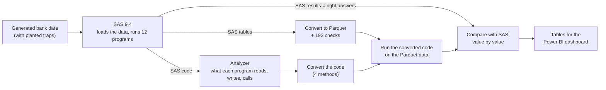

# SAS to PySpark migration, checked against real SAS output

Many banks still run their analytics in SAS and are moving to Spark platforms such as Databricks. Rewriting
the code is only half of that work. The other half is showing that the new code gives the same numbers as
the old code, because SAS and Spark differ in small ways that do not cause errors: they just produce
slightly different results.

This project is a case study of that problem. It contains 12 SAS programs for a fictional Québec retail bank,
run in real SAS 9.4 (SAS OnDemand for Academics); the tables SAS produced are the "right answers". The project
then:

- analyzes the SAS code automatically (what each program reads, writes and calls) and classifies each program,
- converts the SAS data files to Parquet (the file format Spark and Databricks use) and checks that nothing
  changed,
- converts the SAS code to PySpark in four different ways, runs the converted code, and compares its output
  with SAS's output, value by value.

To make the comparison meaningful, the generated data contains a few deliberate traps: values where a
straightforward translation from SAS to Spark gives a wrong answer without any error (for example missing
incomes, a duplicated payment, or names with accented letters that do not fit in a short text column).

The full write-up, including design decisions, limitations and what a production version would need, is in
[docs/TECHNICAL_REPORT.md](docs/TECHNICAL_REPORT.md).

---

## Results

### Moving the data: SAS tables to Parquet

SAS stores tables in its own file format (`.sas7bdat`), which Databricks cannot read directly. The 7 source
tables were converted to Parquet, and each Parquet file was compared each Parquet file with the original SAS table using 192 checks:
the number of rows and columns, the number of empty values, sums and minimum/maximum of every numeric column,
the length of every text column (counted in characters and in bytes, because an accented letter takes two
bytes), every single text value, and a fingerprint (a hash) of every row. **No differences were found.**

A check that never fails proves little, so the checks themselves were tested too: reading a file with the wrong
text encoding, and loading names into a column that was too short, are both detected.

### Reproducing `PROC FORECAST`

`PROC FORECAST` is a SAS procedure with no equivalent in Spark or pandas. The forecasting method it uses was
rebuilt (double exponential smoothing) in Python from the SAS documentation. The 60 forecast values and the
4 final model values match SAS to within 0.00000000035. SAS's confidence limits were not reproduced.

### Converting the code

For each method, a program counts as successfully converted only if every table it writes is identical to
the table SAS wrote (numbers rounded to 6 decimals), and if the planted traps are handled correctly.

| Method | Converted (of 11) | What it was given, and what the result tells us |
|---|---|---|
| **Claude Opus 5** (Anthropic's API) | **11** | For each program, the prompt contained the facts the analyzer found (input and output tables, macros), where each table lives, a set of rules about SAS behaviour written for this project (for example how SAS compares missing values), and the SAS code. 9 programs were right the first time; 2 crashed, and Claude fixed both when shown the error message. Total cost: $0.88. The rules did a lot of the work, and each method ran only once. |
| **Rule-based translator** (written for this project, no AI) | **4** | Fixed templates for the SAS features it knows. It converted 4 programs exactly and refused the other 7 (they use SAS macros, `PROC REG` or `PROC FORECAST`) rather than guess. It never produced a wrong program, but it cannot handle macros, which real SAS code uses everywhere. |
| **qwen2.5-coder 14B** (a local model, run on a laptop with Ollama) | **4** | Exactly the same prompt and rules as Claude. It converted the simpler programs and failed on the complex ones with basic coding mistakes, such as using a Python keyword as a variable name. It is free and the code never leaves the machine, but it took 5.4 hours. |
| **Databricks Lakebridge** (Databricks' own migration tool, using its "Switch" converter and the `gpt-oss-120b` model) with its built-in SAS instructions | **0** | Its default instructions tell the model to turn SAS macro variables into notebook parameters (which nothing fills in), and to cache tables with `.cache()`, which Databricks serverless compute does not allow. So the notebooks stopped before producing anything. |
| **Lakebridge** with the project's instructions | **5** | Same model, same compute. The two problematic instructions were removed and the project's SAS rules added. It went from 0 to 5, which shows how much the instructions matter. The remaining failures came mostly from converting each file separately: a shared macro library and the programs that use it did not agree on names. |

These results hold for these 11 programs, this data and these checks. They are not a promise of how any
method would do on a real bank's code: [section 8](docs/TECHNICAL_REPORT.md#8-results) of the report explains
why the AI methods did not all reach 11, and what to change.

### Lineage: tracing a number back to its source

The analyzer also builds a map of how the programs are connected: which program reads which table, which
program writes it, which programs pull in other programs (`%include`), and which macros (reusable pieces of
SAS code) are defined where and called from where. With that map, any result table can be traced back step by
step to the programs, settings and source files behind it. [docs/lineage.md](docs/lineage.md) shows the map
and a worked example.

---

## How the pieces fit together



---

## Where to find things

| Path | What it contains |
|---|---|
| [docs/TECHNICAL_REPORT.md](docs/TECHNICAL_REPORT.md) | the full write-up |
| [docs/lineage.md](docs/lineage.md) | lineage diagrams and a worked back-tracing example |
| [python/](python/) | the pipeline, one script per step; [`run_all.py`](python/run_all.py) runs them all in order |
| [sas/programs/](sas/programs/) | the 12 SAS programs being migrated |
| [sas/outputs/](sas/outputs/) | the tables SAS produced (the right answers) |
| [rules/](rules/), [prompts/](prompts/) | the conversion rules and the exact prompts sent to the models |
| [converted/](converted/) | the Python code each method produced, unedited, one folder per method |
| [outputs/](outputs/) | every result as a CSV file |
| [tests/](tests/) | 47 automated tests (pytest) |
| [powerbi/](powerbi/) | the dashboard's data model and measures |

If you only read three code files: [`migrate_data.py`](python/migrate_data.py) (SAS tables to Parquet and the
192 checks), [`validate.py`](python/validate.py) (how converted output is compared with SAS), and
[`convert.py`](python/convert.py) (how a program is sent to a model, run, checked and repaired).

---

## Running it

SAS's results and the models' outputs are saved in the repository, so everything else can be rerun on your
own machine in about 30 seconds, without a SAS licence or an API key. You need Python 3.12 and Java 17 (Spark
requires Java).

```bash
python3.12 -m venv .venv && source .venv/bin/activate
pip install -r requirements.lock.txt   # exact versions: the generated data depends on the NumPy version
export JAVA_HOME=$(/usr/libexec/java_home -v 17)   # on macOS; point JAVA_HOME to Java 17 on other systems
export SPARK_LOCAL_IP=127.0.0.1
python python/run_all.py   # generates the data, analyzes, migrates, converts with the rule-based method, runs the tests
```

Rerunning SAS and the AI models as well (`python python/run_all.py --with-sas --with-llm`) needs a SAS OnDemand
for Academics account, Ollama with the `qwen2.5-coder:14b` model, and an Anthropic API key in a `.env` file
(see [.env.example](.env.example)). The [report](docs/TECHNICAL_REPORT.md#14-reproducing-the-results) lists the
setup steps.

---

## Limitations

- The SAS code and data are small (12 programs, about 32,000 rows) and were written to contain known
  problems. Real SAS code is larger and has problems nobody planned for.
- Each conversion method ran once, so how much the AI results would vary between runs is unknown.
- Some planted traps are weaker than they look (for example, the duplicated payment is an exact copy, so it
  cannot show *which* copy was kept). The report lists these in
  [section 11](docs/TECHNICAL_REPORT.md#11-limitations-and-assumptions).
- The Power BI dashboard is built from the tables in `outputs/bi/`; its screenshot will be added to
  [powerbi/](powerbi/).

## License

MIT. All data is generated; there is no real customer data in this repository.
