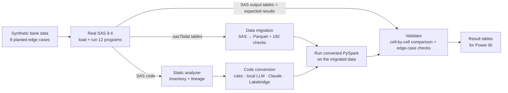

# SAS → PySpark migration with automated equivalence checks

A technical case study: migrate a bank's SAS programs and data to PySpark (the engine behind Databricks), and
check automatically that the migrated code produces the same results as SAS.

The source system is a small, synthetic SAS estate (12 programs on a fictional Québec retail bank) that was
run in real SAS 9.4. Its own output tables are the expected answers. The data contains deliberately planted
edge cases where SAS and Spark behave differently, so that a wrong migration fails loudly instead of silently.

**Full write-up:** [docs/TECHNICAL_REPORT.md](docs/TECHNICAL_REPORT.md) · how each case requirement is met:
[Appendix A](docs/TECHNICAL_REPORT.md#appendix-a-case-requirements-and-where-they-are-met) · why LLM conversion
did not reach 100% and what to do next: [section 8.5](docs/TECHNICAL_REPORT.md#85-why-the-ai-methods-did-not-all-reach-11-and-what-to-change)

---

## Results at a glance

| Question | Result |
|---|---|
| Does the data survive the move from SAS tables (`.sas7bdat`) to Parquet? | No difference found across 192 checks (counts, nulls, sums, min/max, text lengths in characters and bytes, every text value, a SHA-256 fingerprint of every row). A deliberately wrong encoding and a deliberately truncated load are both detected. |
| Can Python reproduce `PROC FORECAST`, which has no Spark equivalent? | Yes for the configuration used: 60 forecasts and 4 model states match SAS within 3.5e-10. Confidence limits are not reproduced. |
| Which method converts the SAS code correctly? | See below. A program counts as converted only if its output tables match SAS's on every check. |

| Method | What it was given | Result | What the result means |
|---|---|---|---|
| **Claude Opus 5** (remote API) | the analyzer's facts about the program, the library paths, the SAS rules the program triggers, the SAS code; one repair with the error or the differing values | **11 of 11** validated (9 first try, 2 after repair); 413 of 413 checks; $0.88 | Every output table of every program matched SAS on every check. Under this harness it converted the whole estate, but the SAS rules and the project's forecast function in the prompt did much of the work, and it ran once. |
| **Rule-based translator** (no LLM) | nothing but its own templates | **4 of 11** (01, 02, 03, 05); 7 refused | It never produced a wrong program: what it converted was exact, and what it could not convert (macro language, `PROC REG`, `PROC FORECAST`) it refused with the reason. Reliable but narrow, since real SAS estates use macros everywhere. |
| **qwen2.5-coder 14B** (local, Ollama) | exactly what Claude was given | **4 of 11** (01, 02, 05, and 04 after repair) | A laptop-sized local model handles the simple programs and fails the complex ones on basic coding errors (a Python keyword as an argument name, wrong paths). Free and private, but 5.4 hours. |
| **Databricks Lakebridge Switch**, built-in SAS prompt | Switch's own SAS instructions, no project facts or rules; model `gpt-oss-120b` on Databricks serverless | **0 of 11** | As shipped, its instructions break on this setup: macro variables become notebook parameters that nothing supplies, and `.cache()` is refused by serverless compute. |
| **Lakebridge Switch**, custom prompt | Switch's instructions with those problems fixed, plus the project's SAS rules; same model and compute | **5 of 11** (01, 02, 03, 05, 09) | The same model went from 0 to 5 purely because of better instructions. The rest failed on cross-file consistency (the macro library and its callers were converted separately) and small output details. |

These are **benchmark results under defined test conditions** (these programs, this data, these checks, one run
per method), not a production reliability estimate. The report explains what each result does and does not
show.

---

## How it works



1. **Data:** a seeded generator creates 500 customers, 800 loans, 21,412 payments and 5,000 card transactions,
   with planted edge cases (missing incomes, an orphan loan, a duplicate payment, refunds, accented names up to
   30 UTF-8 bytes, thresholds stored as text in settings tables).
2. **SAS:** the data is loaded into SAS and 11 business programs run there (DATA steps, joins, `PROC FORMAT`,
   `NODUPKEY` with `FIRST.`/`LAST.`/`RETAIN`, `PROC MEANS`/`FREQ`, macros with `%INCLUDE` and nesting, `PROC REG`,
   `PROC FORECAST`). Their 19 output tables are the expected answers.
3. **Analyze:** a deterministic analyzer lists what each program reads, writes, defines and calls, and builds
   a lineage graph of data (files → tables → programs) and code (`%include`, macros, nested macro calls). Any
   output table can be **traced back** to the programs, settings and source files behind it
   ([docs/lineage.md](docs/lineage.md)).
4. **Migrate data:** SAS tables are converted to Parquet and reconciled against the SAS tables and the source files.
5. **Convert code:** each method writes PySpark; the code is run on the migrated data and its outputs are
   compared with SAS's. LLM methods get one repair attempt with the error or the differing values.

---

## Repository guide

| Path | Contents |
|---|---|
| [docs/TECHNICAL_REPORT.md](docs/TECHNICAL_REPORT.md) | the full write-up: problem, design, validation, results, limitations, production considerations |
| [python/](python/) | the pipeline, one script per step; [`run_all.py`](python/run_all.py) runs them in order |
| [sas/programs/](sas/programs/) | the 12 SAS programs (the legacy code) |
| [sas/data/](sas/data/), [sas/outputs/](sas/outputs/), [sas/logs/](sas/logs/) | SAS tables, SAS results (the expected answers), SAS logs |
| [rules/](rules/), [prompts/](prompts/) | conversion and classification rules, LLM prompts |
| [converted/](converted/) | the PySpark each method generated, kept exactly as produced |
| [outputs/](outputs/) | every result as CSV: inventory, lineage, reconciliation, forecast parity, conversion attempts and checks |
| [tests/](tests/) | 47 tests: data generator, analyzer, rules, data migration, forecast, validator |
| [docs/lineage.md](docs/lineage.md) | data lineage, code lineage and back-tracing, as diagrams |
| [powerbi/](powerbi/) | the dashboard's data model and measures |

Key code: [`migrate_data.py`](python/migrate_data.py) (data migration and reconciliation),
[`validate.py`](python/validate.py) (the validator), [`convert.py`](python/convert.py) (LLM conversion loop),
[`analyzer.py`](python/analyzer.py) (static analysis), [`forecast.py`](python/forecast.py) (`PROC FORECAST` in Python).

---

## Run it

**Quick (about 30 seconds, no SAS account or API key needed).** SAS results and LLM outputs are committed, so
everything else can be rerun locally:

```bash
python3.12 -m venv .venv && source .venv/bin/activate
pip install -r requirements.lock.txt                      # exact versions (the random data depends on NumPy)
export JAVA_HOME=$(/usr/libexec/java_home -v 17)           # Spark needs Java 17 (macOS command; set it your way elsewhere)
export SPARK_LOCAL_IP=127.0.0.1
python python/run_all.py                                  # regenerate, analyze, migrate, convert (rules), summarize, test
```

**Full rerun** (optional): `python python/run_all.py --with-sas --with-llm` also reruns SAS (needs a SAS
OnDemand for Academics account and SASPy) and the LLM steps (needs Ollama with `qwen2.5-coder:14b`, and an
`ANTHROPIC_API_KEY` in a git-ignored `.env`, see [.env.example](.env.example)). Setup details are in the
report's [reproduction section](docs/TECHNICAL_REPORT.md#14-reproducing-the-results).

---

## Scope and honesty notes

- The SAS estate is synthetic and small (12 programs), written to contain known migration risks.
- LLM results come from one run per method; their run-to-run stability was not measured.
- The Power BI dashboard is built from `outputs/bi/`; its screenshot is added in [powerbi/](powerbi/).
- Limitations and what production would require: [report, sections 11–13](docs/TECHNICAL_REPORT.md#11-limitations-and-assumptions).

## License

MIT, see [LICENSE](LICENSE). The data is synthetic: all names, customers and transactions are generated.

One file is an exception: [`prompts/switch_sas_custom_v1.yml`](prompts/switch_sas_custom_v1.yml) is a modified
version of a prompt shipped with Databricks Lakebridge and remains under the Databricks License
([`prompts/LICENSE-databricks.txt`](prompts/LICENSE-databricks.txt)). The notebooks in `converted/lakebridge_*`
were generated by Lakebridge and are kept unedited as test evidence.
