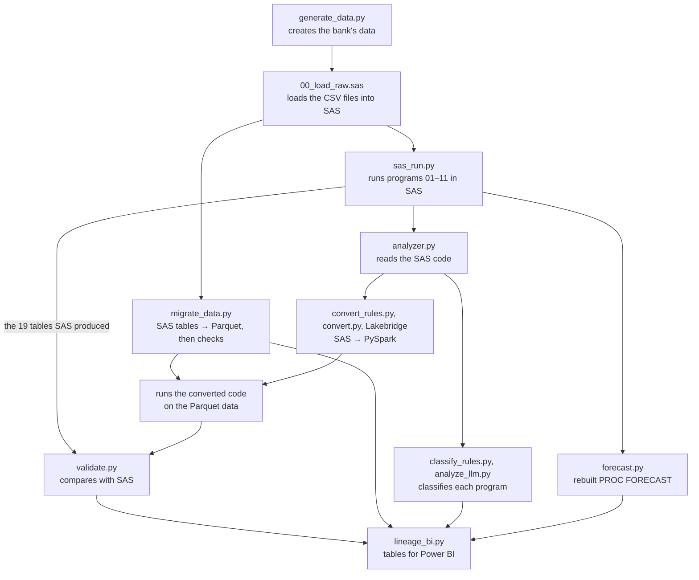

# Technical report: SAS → PySpark migration with automated equivalence checks

Every number in this report comes from a file in [`outputs/`](../outputs/) and can be regenerated with the
scripts in [`python/`](../python/). Status words are used strictly:

| Word | Meaning |
|---|---|
| **Implemented** | the code exists in this repository |
| **Tested** | covered by an automated test in [`tests/`](../tests/) or by the validator |
| **Demonstrated** | shown by a committed result, on this project's data |
| **Future work** | proposed, not done |

---

## 1. Executive summary

Banks are moving analytics from SAS to Spark platforms such as Databricks. The hard part is not translating
the code: it is showing that the new system produces the same numbers, because many SAS behaviours differ
from Spark's in ways that do not raise errors (missing values, duplicate handling, row-order logic, byte-length
text, macro-generated code).

This project builds a small but complete migration pipeline and measures it against SAS itself:

- A synthetic SAS estate (12 programs, 7 source tables, 8 planted edge cases) was run in **real SAS 9.4**;
  its 19 output tables are the expected results.
- The SAS tables were migrated to Parquet and reconciled: **no difference across 192 checks**, and the checks
  were shown to catch a wrong encoding and a truncated load.
- `PROC FORECAST` was reimplemented in Python and matches SAS **within 3.5e-10** on this configuration.
- Four code-conversion approaches were compared under the same validator. **Claude Opus 5 with the project's
  conversion rules validated 11 of 11 programs**; a rule-based translator 4 (refusing the rest); a local
  14B model 4; Databricks Lakebridge 0 with its built-in prompt and 5 with a custom prompt.

The main engineering contribution is the **validation harness**: every converted program is run on the
migrated data and compared cell by cell with SAS's output, plus named checks for each planted edge case.
The results are benchmark results under defined test conditions, not proof of equivalence for every input
(section 11).

---

## 2. Problem and context

**The situation modelled.** A retail bank runs its lending, card and reporting analytics as SAS programs:
DATA steps, SQL, statistical procedures and a macro layer, with settings (thresholds, active reporting
periods) stored in control tables. The bank wants to move to Databricks.

**Why it is risky.** A migration that is wrong usually does not crash. It produces plausible numbers that
differ from SAS's in a few rows. Examples that this project plants on purpose:

| SAS behaviour | What a literal Spark translation does | Consequence |
|---|---|---|
| a missing number is smaller than every number (`if income < 20000` is true for missing) | `null < 20000` is not true | customers without income land in the wrong band |
| `PROC SORT NODUPKEY` keeps the first row of each key | `dropDuplicates()` keeps an arbitrary row | results can change between runs |
| text lengths are in **bytes** (`é` = 2 bytes in UTF-8) | Spark strings have no length | a too-short SAS column silently cuts names, sometimes inside a character |
| macro variables are text pasted into code at run time; table names can be built at run time | hard-coded values and table names | the code stops following the settings tables |
| `PROC FORECAST` has its own initialization | a library ETS model | different forecasts |

**Why real SAS was used.** Guessing what SAS would output is exactly the mistake a migration must avoid, so
every expected value was produced by SAS 9.4 (SAS OnDemand for Academics, driven from Python with SASPy).

---

## 3. Objectives and scope

| Objective | Status |
|---|---|
| Analyze SAS code: inputs, outputs, macros, `%INCLUDE`, dynamic table names, lineage | Implemented, tested |
| Classify programs (business area, technical type, complexity) with rules and with LLMs | Implemented; evaluation exploratory (section 8.4) |
| Migrate SAS tables to Parquet with reconciliation, including encoding and truncation checks | Implemented, tested, demonstrated |
| Reproduce `PROC FORECAST` in Python | Implemented, tested, demonstrated for one configuration |
| Convert SAS code to PySpark with several methods and validate each against SAS | Implemented, demonstrated |
| Power BI data model and dashboard | Tables implemented (`outputs/bi/`); dashboard built manually, see [powerbi/](../powerbi/) |
| Production deployment, orchestration, monitoring, CI | Future work (section 13) |

---

## 4. Architecture

### 4.1 The pipeline

Each box is one Python script (or SAS program). They run in order, and `python/run_all.py` runs them all.



### 4.2 How SAS concepts map to the new platform

| In SAS | In this project | On Databricks |
|---|---|---|
| a table (`.sas7bdat` file) in a library such as `stg`, `ctrl`, `out` | a Parquet file in `data/parquet/<library>/` | a Delta table `catalog.<schema>.<table>` (used in the Lakebridge runs) |
| `LIBNAME` (points a short library name to a folder) | a mapping file, [`python/library_mappings.yaml`](../python/library_mappings.yaml) | a Unity Catalog schema |
| DATA step and PROC SQL | PySpark DataFrame code | the same |
| a macro | a Python function | the same |
| `%include` (copies another program in) | a Python `import` | `%run` of another notebook |
| a macro variable filled from a table (`SELECT ... INTO :var`) | a Python variable read from the table | the same |
| `PROC FORECAST` | [`forecast.py`](../python/forecast.py) | the same module |

The converted PySpark runs on Spark 4.2 on a laptop. Only the Lakebridge runs used Databricks itself
(serverless compute and Delta tables). The pipeline is a set of Python scripts, not a scheduled production job.

### 4.3 The main design rule

Everything that decides whether something is correct is deterministic code: the analyzer, the data checks,
and the comparison with SAS. The AI models only *propose* code, and their code is accepted only if it passes
those checks. SAS's output is the reference for everything.

---

## 5. Data and test design

### 5.1 The generated data

The bank's data is generated by [`generate_data.py`](../python/generate_data.py), using a fixed random seed
(42) so that every run produces exactly the same files; a test checks this.

| Table | Rows | How it is made |
|---|---|---|
| customers | 500 | Québec names and cities (with accents on purpose); incomes follow a log-normal curve (median about $54,000), like real incomes; the customer segment is picked independently of income |
| loans | 800 | the loan amount depends on the type (mortgage, auto, ...); the rate comes from a fixed list; the monthly payment uses the standard loan formula; start dates are spread so that repayments grow over time, which gives the forecast a trend to find |
| loan_payments | 21,412 | one row per loan per month until December 2025; 80% on time, 10% 15 days late, 10% 45 days late (a missed payment, amount 0) |
| card_transactions | 5,000 | amounts are mostly small with a few large ones; `fraud_flag` is set at random for 1% of rows (it is a column to count, not a fraud model) |
| 3 settings tables | 5, 12, 3 | written by hand: customer segments, reporting months (4 active), and parameters stored as **text** (`DPD_THRESHOLD = "30"`) |

Simplifications: loans keep paying after their term ends, missed payments are never caught up, and the loan
status and fraud flag are random.

### 5.2 The planted traps

Each trap answers three questions: what could silently go wrong, which value would trigger it, and how it is checked.

| Planted value | What it tests | How it is checked |
|---|---|---|
| 15 customers with no income | SAS's rule for comparing missing numbers | the 15 must be in the `LOW` band (program 01) and `UNKNOWN` in program 03, which uses a SAS format |
| province written `qc` instead of `QC` | a cleaning step that could be forgotten | every province must be `QC` |
| one payment recorded twice | duplicate removal | 21,412 payments must become 21,411 |
| a loan for customer 999, who does not exist | a join that must drop that loan | 800 loans must become 799 |
| 25 refunds and 5 zero amounts | totals and averages | totals must equal the source totals |
| `Marie-Ève Beauchemin-Laflamme` (29 characters but 30 bytes) and other accented names | text length in bytes, text encoding | the data checks compare lengths in bytes and every text value |
| the city `L'Assomption` | an apostrophe breaking the CSV reading | the data checks |
| settings stored as text in a table | code that types the value in instead of reading it | **cannot be caught by the checks**, see section 11 |

### 5.3 The SAS programs

| Program | What it does | SAS features it uses |
|---|---|---|
| 00_load_raw | loads the 7 CSV files into SAS tables, with a type and a byte length for every column | `INFILE`, `LENGTH` |
| 01_customer_clean | cleans the customer table and puts each customer in an income band | DATA step, `IF/ELSE` with missing values |
| 02_loan_enrichment | joins loans with customers and segments | inner and left joins |
| 03_risk_format | income bands again, using a SAS format (a lookup of value ranges to labels) | `PROC FORMAT`, `PUT` |
| 04_payment_delinquency | removes the duplicate payment, then computes running totals and late flags per loan | `NODUPKEY`; `BY` processing with `FIRST.`/`LAST.` and `RETAIN` (row-by-row logic that carries values from one row to the next); a threshold read from a table |
| 05_card_fraud_summary | card spending and fraud counts per merchant type | `PROC MEANS`, `PROC FREQ` |
| 06_macro_library | defines two reusable macros; produces no data | `%macro` |
| 07_portfolio_report | loan portfolio per segment | `%include` of 06, macro calls, a threshold read from a table |
| 08_period_driver | one summary table per active reporting month | a loop driven by the settings table, macros calling macros three levels deep, table names built while running |
| 09_payment_model | linear regression of the monthly payment | `PROC REG` |
| 10_repayment_forecast | 12-month forecast of total repayments | `INTNX`, `PROC FORECAST` |
| 11_executive_report | a summary built from the outputs of 02, 04 and 10 | depends on three other programs |

"12 programs" means all the SAS code (analysis, lineage, classification). "11 programs" means the ones
converted to PySpark: program 00 only loads files into SAS, and its job is done by
the data migration instead, which copies the tables SAS built rather than rebuilding them from the CSV files.

---

## 6. Implementation

### 6.1 Reading the SAS code: [`analyzer.py`](../python/analyzer.py)

The analyzer reads each SAS program as text, without running it. It removes comments, splits the code into
statements (every SAS statement ends with `;`), and looks for known patterns in each statement: `set` and
`from` mean a table is read, `data` and `create table` mean one is written, `%macro` defines a macro, `into :`
stores a value in a macro variable, and so on. It first collects every macro defined in any program, so that
it can tell a call to one of *our* macros apart from SAS's own macro statements such as `%let` or `%do`.

Some table names cannot be read directly:
- When a table is passed to a macro as an argument, the analyzer records it with medium confidence.
- When a name contains a macro variable (`out.period_summary_&pid`), it cannot know the real name. For
  program 08, SAS was asked to write out the code it actually ran after expanding the macros (the **MPRINT**
  log); the analyzer reads that log and finds the four real table names.

What it produces: an inventory of the 12 programs (lines of code, procedures, macros, joins and so on), a list
of 89 dependencies, and a **lineage graph** of 53 items and 97 connections. The items are 7 source files, 27
tables, 12 programs, 4 macros and 3 libraries. The graph records two kinds of connections:

- **Data lineage:** a source file is loaded into a table (found from the `INFILE` inside each DATA step), a
  program reads a table, a program writes a table.
- **Code lineage:** a program copies another in with `%include`, a program defines a macro, a program or a
  macro calls a macro.

Both are needed in SAS. Program 08 writes its tables through a macro that is defined in program 06, so there is
no table between them, and only the code lineage shows the link.

Tests check that the tables the analyzer thinks are written are exactly the 19 tables SAS actually produced,
that each CSV file is linked to its own table, and that the chain of nested macros
(`%period_driver` → `%run_period` → `%summarize`) is found across the two files.

**Tracing back.** [`lineage_trace.py`](../python/lineage_trace.py) follows the graph backwards from any table.
From the executive report it finds 21 items behind it: the programs, tables, settings table, macros and source
files. [`docs/lineage.md`](lineage.md) shows that trace, a trace of one single number done column by column,
and diagrams of the full data and code lineage.

**Limits.** Pattern matching is enough for these programs, but it would miss some things in real SAS code:
tables without a library prefix, code generated at run time with `CALL EXECUTE`, `%include` through a file
reference, and libraries that connect to a database instead of a folder.

### 6.2 Classifying the programs: [`classify_rules.py`](../python/classify_rules.py) and [`analyze_llm.py`](../python/analyze_llm.py)

The rules are in a YAML file. The **technical type** comes from the first matching test in a fixed order:
forecasting procedure, then regression, then a loop driven by a settings table, then a macro library, then
aggregation, then reporting, then transformation, and data preparation if nothing else matches. The **business
area** comes from counting business words in the code (loan, payment, card, customer, and so on). The
**complexity** is a points score: for example, row-by-row logic (`RETAIN`, `FIRST.`) adds 6 points and each
level of macro nesting adds 3.

The AI models get the analyzer's facts and the code, and must answer in a fixed JSON format that only allows
the defined labels.

### 6.3 Moving the data: [`migrate_data.py`](../python/migrate_data.py)

| Decision | Why |
|---|---|
| Convert from the SAS files (`.sas7bdat`), not from the original CSVs | The migration has to carry what SAS actually stored, including its types, and including any damage done when the data was loaded into SAS. |
| Read them with the `pyreadstat` library; remove trailing spaces; treat empty text as missing | SAS pads text with spaces to the column length and has no concept of an empty string. |
| Store numbers as 64-bit floats and dates as dates | SAS has only two types, numbers (8-byte floats) and text; dates are numbers with a date format. |
| Save SAS's column labels, formats and byte lengths in a small JSON file next to each Parquet file | Parquet has no place for them, and they would otherwise be lost. |
| Write the Parquet file, read it back, and check the copy that was read back | That checks what someone using the data will actually get. |

### 6.4 Rebuilding the forecast: [`forecast.py`](../python/forecast.py)

The SAS program uses `PROC FORECAST METHOD=EXPO TREND=2`, which is Brown's double exponential smoothing.
In short: SAS fits a straight line to the first 12 months to get starting values, then updates two smoothed
series each month with a weight of 0.2, and the forecast is the current level plus the trend times the number
of months ahead. The one detail not fully clear from the documentation was whether time is counted from 0 or
from 1 for the starting line; counting from 1 matches SAS on this data.

### 6.5 Converting the code

| Method | How it works |
|---|---|
| Rule-based translator, [`convert_rules.py`](../python/convert_rules.py) | Fixed templates for the SAS features it knows (DATA step, PROC SQL, `SORT NODUPKEY`, `MEANS`, `FREQ`, `FORMAT`). For anything else it answers "not supported" and says why. |
| AI models, [`convert.py`](../python/convert.py) | One prompt per program containing: the analyzer's facts (input and output tables, macros), where each library's tables are, only the rules from [`rules/conversion_rules.md`](../rules/conversion_rules.md) that apply to this program, and the SAS code ([`prompts/`](../prompts/) has the templates). The answer is checked before running (does it compile, does it mention every table), then run in a separate process with a 5-minute limit, then compared with SAS. If it fails, the model gets **one repair attempt**: the same prompt plus the error message or the first 15 differences. |
| Databricks Lakebridge, [`lakebridge_run.py`](../python/lakebridge_run.py) | Lakebridge's converter (called Switch) runs inside Databricks and writes one notebook per program. The script downloads each notebook unchanged, runs it on Databricks, reads the resulting tables back, and compares them with SAS in the same way. |

Claude Opus 5 (through Anthropic's API) and qwen2.5-coder 14B (a local model run with Ollama, set to be as
repeatable as possible: temperature 0, fixed seed) went through exactly the same process. Each converted
program reads the tables written by the same method's earlier programs, just as in SAS, so a mistake early on
affects the programs after it. The generated code was never edited by hand.

---

## 7. How correctness is checked

### 7.1 Checking the data after the move to Parquet

The question is simple: after copying a SAS table to Parquet, is every value still there and unchanged? The
two copies are compared at several levels, from rough to exact:

| Level | What is compared | What it would catch | Example from the customers table (SAS = Parquet) |
|---|---|---|---|
| Shape | number of rows and columns, column names | lost or extra rows, lost or renamed columns | 500 rows, 7 columns |
| Numeric columns | number of empty values, sum, smallest and largest value | values that became empty, changed or lost numbers | income: 15 empty, sum 28,920,482, from 8,741 to 265,515 |
| Text columns | number of empty values, longest value counted in **characters** and in **bytes**, number of different values | cut-off text, damaged accents (a damaged accent changes the byte count), categories merged together | names: longest 29 characters / 30 bytes, 243 different names |
| Every text value | each text cell against its counterpart | any changed character anywhere | 0 differences |
| Every row | a fingerprint of each row (explained below) | any changed value in any column, and lost, extra or duplicated rows | 0 rows only in SAS, 0 only in Parquet |
| The source file | the original CSV against the SAS table, for text columns | damage done when the CSV was loaded into SAS, before the migration | 0 differences |
| A deliberate failure | the correct file against the same file read with the wrong text encoding | proves the text checks can fail | the corruption was detected |

**The row fingerprint.** Each row is written out as one line of text, with the columns in alphabetical order,
numbers with 9 decimals, dates as text and empty values as `<NULL>`. Customer 8, for example, becomes
`35392.000000000|Saint-Jérôme|8.000000000|Marie-Ève Beauchemin-Laflamme|2018-07-23 00:00:00|qc|RETAIL`. That
line goes through SHA-256, which turns it into a 64-character code; changing a single character gives a
completely different code. The codes of both tables are then sorted, and the two lists must be identical. That
way a lost row, an extra row or a duplicated row is caught too, not only a changed one.

**In total: 192 checks** (163 comparing SAS and Parquet across the 7 tables, 28 comparing the CSV files with
SAS, and the deliberate failure). All passed; the details are in
[`outputs/reconciliation_results.csv`](../outputs/reconciliation_results.csv).

**Do the checks catch real damage?** To find out, the customer names were loaded into SAS a second time with the
name column set to 12 bytes instead of 60, and ran three more checks against that version. They are meant to
fail, and they do: the longest name drops from 29 to 12 characters, 444 of the 500 names are different, and 12
names are cut in the middle of an accented letter, leaving invalid text. SAS gave no error or warning when this
happened. The script only reports a problem when a check does not behave as expected.

**What these checks cannot tell you.** Both sides of the comparison were read with the same library
(`pyreadstat`), so if it misread something, both sides would agree and nothing would be flagged. The column
labels, formats and lengths saved in the JSON files are not compared. Column types are not compared directly.
Having SAS compute its own summary numbers and comparing those would remove the first weakness (section 12).

### 7.2 Checking the converted code: [`validate.py`](../python/validate.py)

A converted program counts as correct only if all of the following are true:

1. It compiles, mentions every input and output table of the SAS program, and uses no hard-coded file paths.
2. It runs to the end within 5 minutes.
3. It writes every table SAS wrote.
4. Each of those tables passes the same checks as the data migration against SAS's table. Numbers are rounded
   to 6 decimals, and rows are sorted first, because Spark does not keep rows in the order SAS does.
5. The trap checks for that program pass. There are 7: missing incomes in `LOW`, missing incomes in `UNKNOWN`,
   provinces in upper case, the orphan loan dropped, the duplicate payment removed, refunds included in the
   totals, and one table per active month.

A single failed check out of 65 means the program is not converted. Program 06 writes no table, so it counts as
correct only if every program that uses its macros is correct.

### 7.3 Checking the checks

- There are **47 automated tests** in [`tests/`](../tests/). They cover the traps in the generated data and
  that the data is the same on every run; the analyzer's findings against what SAS really produced; the
  classification rules on small SAS snippets; the data migration results; the forecast; and the validator.
- The validator was tested by feeding it deliberately wrong versions of a correct result: missing incomes put in
  `HIGH`, provinces left in lower case, a row removed. Each one fails. One lesson from this: the realistic
  mistake (missing incomes in the wrong band) still passes the row counts, the empty-value counts, the sums and
  the number of different values. Only the value-by-value and fingerprint checks catch it.
- During the first full run, the checking code itself had three bugs, and each one made correct code fail: it
  expected table names built at run time to appear literally in the code; Spark's worker processes started
  with a different Python version; and it picked up table names from comments. They were fixed and the
  affected conversions were rerun from scratch.

---

## 8. Results

### 8.1 Data migration

All 192 checks passed on the 7 tables, and the deliberate failure and the cut-off names were caught as
intended ([`outputs/reconciliation_results.csv`](../outputs/reconciliation_results.csv)).

### 8.2 Forecast

All 60 values (48 fitted months plus 12 future months), their dates, and the 4 final values the method keeps
internally match SAS to within 0.00000000035 ([`outputs/forecast_parity.csv`](../outputs/forecast_parity.csv)).
This was checked for this one data series and these settings.

### 8.3 Code conversion

✅ means every check passed. ❌ shows the main reason for failing. "Via 07, 08" means program 06 is judged by the
programs that use it; "Earlier program failed" means its input table was never written.

| Program | Claude | Rule-based | qwen (local) | Lakebridge, default instructions | Lakebridge, project instructions |
|---|---|---|---|---|---|
| 01 customer clean | ✅ | ✅ | ✅ | ❌ asks for a parameter | ✅ |
| 02 loan enrichment | ✅ | ✅ | ✅ | ❌ earlier program failed | ✅ |
| 03 risk format | ✅ | ✅ | ❌ wrong file path | ❌ asks for a parameter | ✅ |
| 04 payment delinquency | ✅ | refused | ✅ after repair | ❌ `.cache()` not allowed | ❌ extra column |
| 05 card fraud summary | ✅ | ✅ | ✅ | ❌ wrong percentages | ✅ |
| 06 macro library | ✅ via 07, 08 | refused | ❌ via 07, 08 | ❌ via 07, 08 | ❌ via 07, 08 |
| 07 portfolio report | ✅ after repair | refused | ❌ Python keyword misuse | ❌ invalid SQL | ❌ missing columns |
| 08 period driver | ✅ after repair | refused | ❌ crash | ❌ asks for a parameter | ❌ wrong macro argument |
| 09 payment model | ✅ | refused | ❌ wrong file path | ❌ asks for a parameter | ✅ |
| 10 repayment forecast | ✅ | refused | ❌ type error | ❌ asks for a parameter | ❌ pandas error |
| 11 executive report | ✅ | refused | ❌ earlier program failed | ❌ calls a function that doesn't exist | ❌ earlier program failed |
| **Converted** | **11** | **4** | **4** | **0** | **5** |

What each method was given, and how to read its result:

- **Claude Opus 5 (11 of 11).** For each program it got the analyzer's facts, the library locations, the
  conversion rules relevant to that program, and the SAS code. Nine programs were right the first time. Two
  crashed on simple mistakes (07 wrote its output to a doubled path; 08 sorted by an empty list of columns),
  and Claude fixed both when shown the error. Across all programs, 413 of 413 checks passed. It took 13 model
  calls, about 5 minutes and $0.88. Two things helped it a lot: the rules in the prompt spelled out the SAS
  behaviour behind each trap, and for program 10 the prompt tells it to use the project's forecast module rather than
  write the algorithm itself. Each SAS file also starts with a comment that describes what it does. So the
  result shows what Claude achieved with this help, not what it would do on unfamiliar code.
- **Rule-based translator (4 of 11).** It had only its own templates. The four programs it converted passed
  every check. It refused the other seven: five use SAS macros (program 04 only because of one macro variable,
  the late-payment threshold), one uses `PROC REG` and one `PROC FORECAST`. It never produced a wrong program;
  it just can't handle macros, which real SAS code relies on heavily.
- **qwen2.5-coder 14B (4 of 11).** It got exactly the same prompts and repair attempt as Claude. It converted
  01, 02 and 05 directly and 04 after the repair. Its failures were basic programming mistakes: `class=` used as
  an argument name (a reserved word in Python), `.parquet` added to paths even though the rules said not to,
  and a table built without telling Spark the column types. In 4 of its 7 repair attempts, the new answer was
  exactly as long as the first one, which suggests it ignored the error it was shown. It took 5.4 hours on a
  16 GB laptop.
- **Lakebridge with its default instructions (0 of 11).** Lakebridge is Databricks' migration toolkit. It was
  run with the `gpt-oss-120b` model on Databricks serverless compute, using the SAS instructions that ship with
  it. Those instructions tell the model to turn SAS macro variables into notebook parameters, which nothing
  supplies when the notebook runs, and to cache tables with `.cache()`, which serverless compute does not
  allow. Most notebooks stopped for those two reasons. The same instructions also tell the model to remove
  duplicates with `dropDuplicates()`, which this data cannot catch (section 11).
- **Lakebridge with the project's instructions (5 of 11).** Same model, same compute. The instructions start
  from Lakebridge's own SAS instructions, remove the parts that caused the crashes, and add the project's
  conversion rules
  ([`prompts/switch_sas_custom_v1.yml`](../prompts/switch_sas_custom_v1.yml)). It went from 0 to 5. Most of the
  remaining failures come from converting each file on its own: the macro library and the programs that use it
  were converted separately and did not agree on names and outputs.

All results are in [`outputs/conversion/`](../outputs/conversion/). The generated code is in
[`converted/`](../converted/), one folder per method.

### 8.4 Classification

Share of programs where the method's label matched the answer key (12 programs):

| Method | Business area | Technical type | Complexity |
|---|---|---|---|
| Rules | 67% | 100% | 58% |
| Claude Opus 5 | 75% | 75% | 42% |
| qwen2.5-coder 14B | 50% | 75% | 25% |

These numbers do not show which method is better, for four reasons. The answer key and the rules
were designed together, so they naturally agree. The rules were adjusted while looking at 3 of the 12 programs.
One rule simply checks whether the file name contains "report". And with only 12 programs, a single program
changes a percentage by more than 8 points. A fair comparison would need programs nobody wrote for this
project, labelled by someone who has not seen the rules.

### 8.5 Why the AI methods did not all reach 11, and what to change

Only one setup converted all 11 programs, and it had help. The case asked for a **local** solution, and the
local model reached 4. Databricks' tool reached 0 with its default instructions and 5 with the project's. Looking at the
failures, these are the causes:

| Cause | What was observed | Where |
|---|---|---|
| The local model is less capable | With the same prompts, rules and repair attempt, qwen made basic mistakes that Claude did not (a reserved word as an argument name, wrong paths despite a rule, a table built without column types). | qwen: 03, 07, 08, 09, 10 |
| Error feedback was ignored | In 4 of 7 repairs, qwen's second answer was exactly as long as its first. | qwen |
| Each file is converted on its own | The macro library (06) and the programs that use it (07, 08) are converted separately, so each has to guess how the other names things. Lakebridge's 08 passed an argument that its 06 didn't define, and its 06 left out two columns that 07 needed. Even Claude's working 08 contains extra code that checks, while running, which argument names 06 accepts, and tries three different output paths. It works, but only because Claude wrote defensively. | Lakebridge 07, 08; a hidden risk in Claude's 08 |
| The tool's defaults don't fit SAS | Lakebridge's default instructions asked for notebook parameters and `.cache()`. Its default text preprocessing also treated `--` as the start of a SQL comment, and SAS comment banners made of dashes caused it to delete most of the code before the model saw it. | Lakebridge with default instructions |
| Only one repair | Two of Claude's programs needed their repair. Only one was allowed, to keep the comparison fair. | all AI methods |
| One failure causes more | Each program reads the output of earlier programs from the same method, so one failure takes others down with it. | qwen 06, 11; Lakebridge 02, 06, 11 |
| Small output details | A helper column left in the output; percentages calculated within each group instead of over the whole table. | Lakebridge 04, 05 |
| The rules did a lot of the work | The project's SAS rules and the forecast module carried knowledge the models might not have had. How much the results depend on them was not measured. | all AI methods |

**What to try next**, starting with what should help most:

1. **Convert in dependency order and pass the interfaces along.** Convert program 06 first, extract the names
   of its functions, their arguments and the columns they produce, and put that into the prompts for 07 and 08.
   This removes the guessing that broke Lakebridge's 07 and 08 and made Claude's 08 defensive.
2. **Use the rule-based translator first.** It never produced a wrong program, so use it wherever it can, and
   send only the remaining programs to an AI model.
3. **Add automatic clean-up and guards.** Remove columns that SAS doesn't have, reject `.cache()` and other
   unsupported calls, and check the column list against SAS before running the full comparison.
4. **Better repairs.** Allow two or three attempts, show the model the exact columns that differ with a few
   example rows, and stop if the model returns the same code again.
5. **Give the local model examples.** Include programs that were already converted correctly as examples in the
   prompt, and try a larger local model if the hardware allows.
6. **Measure each program on its own.** Give each converted program SAS's own input tables, so one failure
   doesn't hide the quality of the programs after it, and repeat each run several times to see how stable the
   results are.
7. **Keep a person in the loop** for heavily macro-driven code and for SAS code that generates other code
   (`CALL EXECUTE`), and treat those programs as high risk.

---

## 9. Two worked examples

### 9.1 Program 01, from SAS to a checked result

The SAS code that decides the income band:

```sas
if annual_income < 20000 then income_band = 'LOW';
else if annual_income < 80000 then income_band = 'MID';
else income_band = 'HIGH';
```

The prompt to Claude contained the analyzer's facts (reads `stg.customers`, writes `out.customers_clean`),
where the tables are, five rules including the one about missing values, and this code. Claude wrote
([`p01_customer_clean.py`](../converted/llm_remote/run1/p01_customer_clean.py)):

```python
F.when(F.col("annual_income").isNull() | (F.col("annual_income") < 20000), F.lit("LOW"))
 .when(F.col("annual_income") < 80000, F.lit("MID"))
 .otherwise(F.lit("HIGH"))
```

The `isNull()` part is what makes a missing income count as `LOW`, as in SAS. The script ran on the Parquet
data and wrote 500 rows, which were compared with SAS's table: 41 checks, all passed. For example, the income
band column has 0 different values, the missing-income flag adds up to 15 on both sides, and the row
fingerprints are identical. The trap check confirmed that the 15 customers without income are `LOW`.

To see what a mistake looks like, the same result was changed to put those 15 customers in `HIGH`, which is what a
translation without `isNull()` would do. Three checks fail: the value-by-value comparison of the band column,
the row fingerprints, and the trap check.

### 9.2 Macros, before and after

**A macro library becomes Python functions.** Program 06 defines this macro:

```sas
%macro summarize(ds=, class=, var=, out=);
  proc means data=&ds noprint nway;
    class &class; var &var;
    output out=&out(drop=_type_ _freq_) n=n sum=total mean=avg;
  run;
%mend summarize;
```

Claude turned it into a Python function with the same keyword arguments
([`p06_macro_library.py`](../converted/llm_remote/run1/p06_macro_library.py)). Because `class` is a reserved
word in Python, the argument is called `class_`, and `class=` is still accepted through `**kwargs`:

```python
def summarize(ds=None, class_=None, var=None, out=None, **kwargs):
```

In programs 07 and 08, `%include "&root/programs/06_macro_library.sas"` became
`from p06_macro_library import *`.

**A macro variable read from a table, driving nested macros.** Program 08 reads the active months from the
settings table into a macro variable, then loops over them. Each step of the loop calls a macro, which calls
another macro, and the output table name is built from the month:

```sas
proc sql noprint;
  select period_id into :period_list separated by ' '
  from ctrl.reporting_periods where active_flag = 1 order by period_id;
quit;
%macro period_driver;
  %do i = 1 %to %sysfunc(countw(&period_list, %str( )));
    %let pid = %scan(&period_list, &i, %str( ));
    %run_period(&pid);          /* calls %summarize(..., out=out.period_summary_&pid) */
  %end;
%mend period_driver;
```

In Claude's version ([`p08_period_driver.py`](../converted/llm_remote/run1/p08_period_driver.py)), the macro
variable becomes a Python list read from the settings table, `%do` becomes a `for` loop, and the table name is
built with an f-string (shortened here):

```python
period_list = [r[0] for r in (spark.read.parquet(f"{CTRL}/reporting_periods.parquet")
               .filter(F.col("active_flag") == 1).orderBy("period_id").select("period_id").collect())]

def run_period(pid):
    pay = spark.read.parquet(f"{OUT}/delinquency").filter(F.col("period_id").cast("string") == str(pid))
    target = f"{OUT}/period_summary_{pid}"
    ...  # calls summarize(...) from the converted macro library

def period_driver():
    for i in range(1, len(period_list) + 1):
        run_period(period_list[i - 1])
```

The comparison found exactly the four tables SAS wrote (`period_summary_202509` to `period_summary_202512`),
each identical to SAS's.

In programs 04, 07 and 11, a setting read into a macro variable (`select param_value into :dpd_threshold`)
became a Python value read from the table and converted from text to a number, roughly
`float(spark.read.parquet(...).filter(F.col("param_name") == "DPD_THRESHOLD").first()[0])`.

---

## 10. Problems encountered

| Problem | What happened | What was done |
|---|---|---|
| SAS counts text length in bytes | The first load declared the name column as 12 bytes. SAS cut 444 of the 500 names without any warning, some in the middle of an accented letter, which left text that isn't even valid UTF-8. | The length was set from the longest name measured in bytes (60), checks were added that compare the source file with SAS, and the broken load was kept as proof that the checks catch it. |
| Missing values | SAS and Spark disagree on comparisons, formats, sums and group counts involving missing values. | Explicit rules in the conversion prompt, and trap checks where the data contains missing values. |
| Table names built while running | Program 08 creates its table names from the month. | SAS's MPRINT log (the code SAS actually ran) gives the real names, for lineage and for checking. |
| No Spark equivalent | `PROC FORMAT` and `PROC FORECAST` have no direct replacement. | The format became a chain of conditions; the forecast was rebuilt and matched to SAS. |
| The checking code had bugs | Three bugs made correct code fail (section 7.3). | Fixed them, added tests that feed the validator deliberately wrong results, reran. |
| Setting up Lakebridge | The Databricks command-line tool and Lakebridge conflicted over how to log in; catalogs could only be created in the web interface; permissions had to be granted by name; the default text preprocessing deleted most of the SAS code. | Worked around each one; set the source format to "generic" for SAS files. |
| Databricks serverless limits | `.cache()` is not allowed, and notebooks waited in a queue for between 40 seconds and 27 minutes. | The project's instructions for Lakebridge forbid caching. |

---

## 11. Limitations and assumptions

| Limitation | Why it matters |
|---|---|
| The data and code are small (12 programs, about 32,000 rows) and were written to contain known problems. | Real SAS code is larger and has problems nobody planned. There is no evidence here about performance. |
| Each conversion method ran once. | How much the AI results vary from run to run is unknown. Claude Opus 5 doesn't allow setting the temperature, so its answers can differ. |
| The duplicate payment is an exact copy. | The check can confirm the duplicate was removed, but not that the *first* copy was kept, which is SAS's rule. `dropDuplicates()` would also pass. |
| The settings table holds 30, the same value a programmer would type in. | The checks cannot tell whether the converted code reads the setting or has 30 written in it. Reading Claude's code shows that it does read the setting. |
| Some missing-value cases never occur in the data (there are no missing payment amounts, days late or group values). | The rules for those cases are in the code but not tested. |
| Both sides of the data comparison are read with the same library (`pyreadstat`). | A reading error would affect both sides equally and go unnoticed. The only independent evidence is that the converted programs reproduce totals that SAS computed itself. |
| Numbers are rounded to 6 decimals and then compared exactly; types, column order and row order are not compared. | A value right on a rounding boundary could make correct code fail, and a change of type could go unnoticed. |
| SAS's labels, formats and lengths are saved but not checked. | If they were lost, nothing would flag it. |
| The forecast was matched for one data series and one set of settings, without confidence limits. | Other settings are not verified. |
| The prompts contain rules written for these specific traps, and each SAS file starts with a descriptive comment. | The AI results partly measure the project's setup, not only the model. |
| The classification answer key was not written independently. | Section 8.4. |
| The automatic lineage works at table level, and database libraries are not recognised. | Tracing which columns feed a number, or finding database sources, would need more work. |

**Assumptions.** SAS's output is correct by definition. The Parquet copy of the data is what the converted code
should read. A difference smaller than the 6th decimal place does not matter to the business.

---

## 12. What could be done better

With more time, in order of value:

1. **Independent reconciliation profiles computed inside SAS** (`PROC MEANS`, `PROC FREQ`, counts) compared
   with the same profiles computed by Spark, so the check does not rely on the reader that did the migration.
2. **Targeted behavioural test cases**: a duplicate whose copies differ, a changed threshold in the control
   table (the output must change), missing values in every numeric column used in a rule, boundary values.
   Run each through SAS and through the converted code.
3. **Explicit comparison rules per column**: exact for keys, counts, dates and text; agreed precision for
   amounts; absolute plus relative tolerance for model outputs; plus type checks.
4. **Repeated LLM runs** and **ablations** (without the rules, without the header comments) to measure how much
   of the conversion result comes from the model versus the harness.
5. **Per-program scoring with SAS's upstream tables as inputs**, so a single upstream failure does not hide
   the quality of downstream conversions.
6. **An independent classification answer key** on programs not written for this project.
7. **Routing**: rules first where they apply (free, deterministic), LLM for the rest, validation for all.

---

## 13. Production considerations

What a real migration would add beyond this proof of concept (none of this is implemented here):

| Area | What would be needed |
|---|---|
| Assurance | parallel runs of SAS and Databricks on production data over several cycles; sign-off per program; exceptions that cannot be ignored silently |
| Data contracts | explicit schemas (types, precision, nullability) plus business metadata (labels, units) and SAS-compatibility metadata, stored in a catalog, not side files |
| Orchestration | Databricks Jobs or pipelines instead of local scripts; dependencies from the lineage graph |
| Code management | converted code reviewed by humans, versioned, deployed through CI with the validator as a gate |
| Observability | row counts, reconciliation results and data-quality checks recorded per run, with alerting |
| Security | secrets in a vault, access through Unity Catalog permissions, no personal data in test fixtures |
| Scale | the local Spark runs say nothing about performance; partitioning and cluster sizing need real volumes |
| Analysis | a real SAS parser or SAS's own logs (`PROC SCAPROC`) for inventory and column-level lineage; `CALL EXECUTE` and generated code treated as high risk |

---

## 14. Reproducing the results

| What you want to rerun | What you need | Command |
|---|---|---|
| Everything except SAS and the AI models (uses the saved SAS and model outputs) | Python 3.12 and Java 17 | `python python/run_all.py` (about 30 seconds, including the 47 tests) |
| SAS | A SAS OnDemand for Academics account. SASPy, plus three encryption files from SAS placed in SASPy's `java/iomclient` folder (SAS provides them, they cannot be redistributed). The password in `~/.authinfo`, and your region in [`sas/sascfg_personal.py`](../sas/sascfg_personal.py). | `python python/run_all.py --with-sas` |
| The AI models | Ollama with `qwen2.5-coder:14b`, and an Anthropic API key in a `.env` file (never committed) | `python python/run_all.py --with-llm` (Claude costs about $1; the local model takes several hours) |
| Lakebridge | A Databricks workspace with Lakebridge installed, the source tables loaded as Delta tables in `workspace.stg` and `workspace.ctrl` (done once by hand; not scripted), and a Databricks CLI profile | Lakebridge's `llm-transpile` command, then `python python/lakebridge_run.py --ws-folder <folder> --method <name>` |

Versions: SAS 9.4 M8 (UTF-8 session), Python 3.12, PySpark 4.2, Java 17, SASPy 5.109, Ollama 0.34, Lakebridge
0.15.2. The exact Python packages are in [`requirements.lock.txt`](../requirements.lock.txt). Rerunning from a
fresh clone produced every result file byte for byte, apart from the columns that record timings.

---

## 15. Key takeaways

- **Translating code is the easy part; the validation harness is the product.** Every result in this project
  is only as credible as the comparison with SAS's own output.
- **Silent semantic differences dominate the risk.** Missing values, deduplication, row order and byte lengths
  do not crash; they need targeted data and value-level checks, not row counts.
- **Checks must be shown to fail.** The negative test, the truncation evidence and the validator's mutation
  tests are what make "no difference found" meaningful.
- **LLM conversion quality depends heavily on context.** The same Lakebridge model went from 0 to 5 of 11 with a
  better prompt; Claude's 11 of 11 relied on explicit SAS rules. Deterministic rules remain valuable where they
  apply, because they refuse instead of guessing.
- **State what a result does not show.** The untested paths listed in section 11 matter as much as the passing
  checks.

---

## Appendix A: case requirements and where they are met

The case ("Automating code analysis and migration from syntax A to syntax B") with A = SAS and B = PySpark,
plus the requirements added in the interview.

**Written case**

| Requirement | Status | Where |
|---|---|---|
| A local pipeline (local LLM or open-source models) | Implemented: analyzer, rules, data migration, validation and the qwen2.5-coder 14B LLM all run locally; Claude (remote API) and Lakebridge (Databricks) were added as comparisons | [`python/`](../python/), [`python/config.yaml`](../python/config.yaml) |
| 1. Read and parse the scripts from a directory | Implemented, tested | [`analyzer.py`](../python/analyzer.py) reads `sas/programs/` |
| 2. LLM extraction: business category, technical category, complexity, description | Implemented (local and remote LLM, JSON schema) | [`analyze_llm.py`](../python/analyze_llm.py), [`prompts/analysis_prompt_v1.md`](../prompts/analysis_prompt_v1.md), results in [`outputs/llm_analysis_*.csv`](../outputs/) |
| 3. Deterministic (rule-based) extraction and comparison with the LLM | Implemented; accuracy, agreement and Cohen's kappa computed; evaluation exploratory (section 8.4) | [`rules/classification_rules_v1.yaml`](../rules/classification_rules_v1.yaml), [`compare.py`](../python/compare.py), [`outputs/comparison_summary.csv`](../outputs/comparison_summary.csv), [`outputs/method_agreement.csv`](../outputs/method_agreement.csv) |
| 4. Convert each script; run original and converted on test data; report differences | Implemented, demonstrated | sections 6.5, 7.2, 8.3; [`outputs/conversion/`](../outputs/conversion/) |
| Deliverables: documented pipeline, output files, report on challenges | This repository; challenges in section 10 | – |

**Interview requirements**

| Requirement | Status | Where |
|---|---|---|
| Assess code before converting: per-script tables created, inputs, outputs | Implemented, tested | [`outputs/migration_inventory.csv`](../outputs/migration_inventory.csv), [`outputs/program_dependencies.csv`](../outputs/program_dependencies.csv) |
| Detect source databases (`LIBNAME`) | **Partial**: path `LIBNAME`s are recorded and mapped to the target ([`library_mappings.yaml`](../python/library_mappings.yaml)); SQL pass-through is flagged; database engines in `LIBNAME` are not detected | section 6.1 |
| Conversion through LLM calls with purpose-written prompts and injected source→target rules; no agent | Implemented: one call per program plus one repair | [`prompts/`](../prompts/), [`rules/conversion_rules.md`](../rules/conversion_rules.md) |
| Business description, technical description and categorization per script in one CSV | Implemented | [`outputs/llm_analysis_claude_opus_5.csv`](../outputs/llm_analysis_claude_opus_5.csv), [`outputs/llm_analysis_qwen2.5_coder_14b.csv`](../outputs/llm_analysis_qwen2.5_coder_14b.csv) |
| Code beyond simple ETL: macros, nested macros, macro variables from a database, with before/after | Implemented, demonstrated | programs 04, 06, 07, 08, 11; section 9.2 |
| `.sas7bdat` → Parquet with reconciliation, truncation and French accents, "zero data loss" | Implemented, tested: no loss **detected** across 192 checks; truncation and wrong encoding shown to be caught | sections 6.3, 7.1 |
| Code lineage + data lineage, including program-to-program links through macros and `%include`, visualized in Power BI | Implemented at table level: 53 nodes, 97 edges, from source files to report tables, with `INCLUDES`, `DEFINES` and nested `CALLS` edges; automated back-tracing of any table; one value traced to column level by hand. Automated column-level lineage not implemented | [`docs/lineage.md`](lineage.md), [`lineage_trace.py`](../python/lineage_trace.py), [`outputs/lineage_paths.csv`](../outputs/lineage_paths.csv), [powerbi/](../powerbi/) |
| `PROC FORECAST` replicated from SAS's method so Python matches SAS | Implemented, demonstrated (3.5e-10) | [`forecast.py`](../python/forecast.py), section 8.2 |
| Power BI on a designed data model | Model tables implemented; dashboard built in Power BI Desktop (the `.pbix` is not in this repository) | [powerbi/](../powerbi/) |
| One zip with presentation, `.pbix`, outputs, code and prompts | Outputs, code and prompts are in this repository; the presentation and `.pbix` are delivered separately | – |

---

## Appendix B: design decisions

**Dataset: fully synthetic, seeded.** The SASHELP tables, public mortgage data, NYC Taxi and the Berka
financial dataset were considered. None of them contains all the edge cases needed (missing values in a
rule, an orphan key, an exact duplicate, 30-byte accented names, settings stored as text), and several do not
span multiple business domains. A generator gives multiple domains (customers, lending, payments, cards,
reporting), a monthly series for the forecast, control tables that drive the macros, French names, known
answers for every edge case, and no licensing question. The cost is realism (section 11).

**Local model: qwen2.5-coder 14B** (Ollama, temperature 0, fixed seed, 32k context). It is a code-specialised
model that runs on a 16 GB laptop. The initial plan named the 7B variant; the 14B variant was used. Prompts stayed under
3,000 tokens, well inside the context.

**Prompt structure.** Extraction and conversion use separate prompts. Extraction: analyzer facts ("treat as
ground truth"), the code, the allowed labels, and a JSON schema that makes other answers impossible.
Conversion: role and goal (equivalent numbers, not style), analyzer facts, library paths, **only the rules the
program triggers**, the SAS code, and "return the script only". Repair: the error or the differing checks, plus
the previous script.

**Forecast method: `METHOD=EXPO TREND=2`.** It is fully specified by a few documented formulas (Brown double
exponential smoothing with OLS start values), so parity is achievable. The default stepwise autoregressive
method selects lags automatically and would be much harder to reproduce exactly.

**`.sas7bdat` reader: `pyreadstat`**, reading with the file's declared encoding, then PyArrow with an explicit
schema. The checks cover structure, statistics, text in characters and bytes, and every row's fingerprint,
plus the source files. An independent profile computed inside SAS would strengthen this (section 12).

**Lineage in Power BI.** Programs, tables, macros and libraries are nodes in one edge table
(`FactLineageEdge`), shown as a network graph with filters on relationship and confidence. The model is two
stars (migration results; bank data, snowflaked through segment → customer → loan), described in
[powerbi/](../powerbi/).

**Changes from the initial plan.**
- The local model moved from qwen2.5-coder 7B to 14B.
- The repair loop allows one repair instead of three, which keeps the comparison between methods fixed.
- Comparison uses row fingerprints (multisets of SHA-256 hashes) instead of key-based diffs, so no key has to be chosen per table and duplicated rows still count.
- The .sas7bdat reader is pyreadstat.
- Claude and Lakebridge were added as comparison methods.

**Main risks, and how they played out.**

| Risk | Mitigation | Outcome |
|---|---|---|
| SAS OnDemand connection from Python | SASPy with the required encryption jars | worked after installing SAS's jars |
| Local model too slow or too weak | kept the rule-based method as a baseline; added a remote model for comparison | 5.4 hours for 4 of 11 |
| Validator wrongly failing correct code | mutation tests, fixed harness bugs, reran | three harness bugs found and fixed |
| Forecast parity not reachable | chose the documented `EXPO TREND=2` method | matched within 3.5e-10 |
| Encoding and truncation | byte-length checks and a deliberately truncated load | truncation caught |
