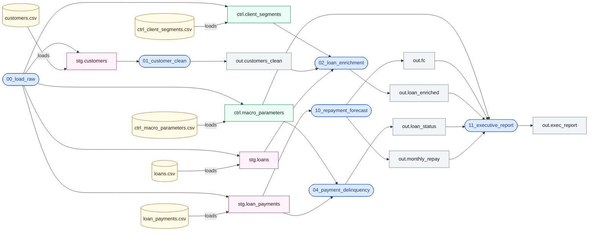
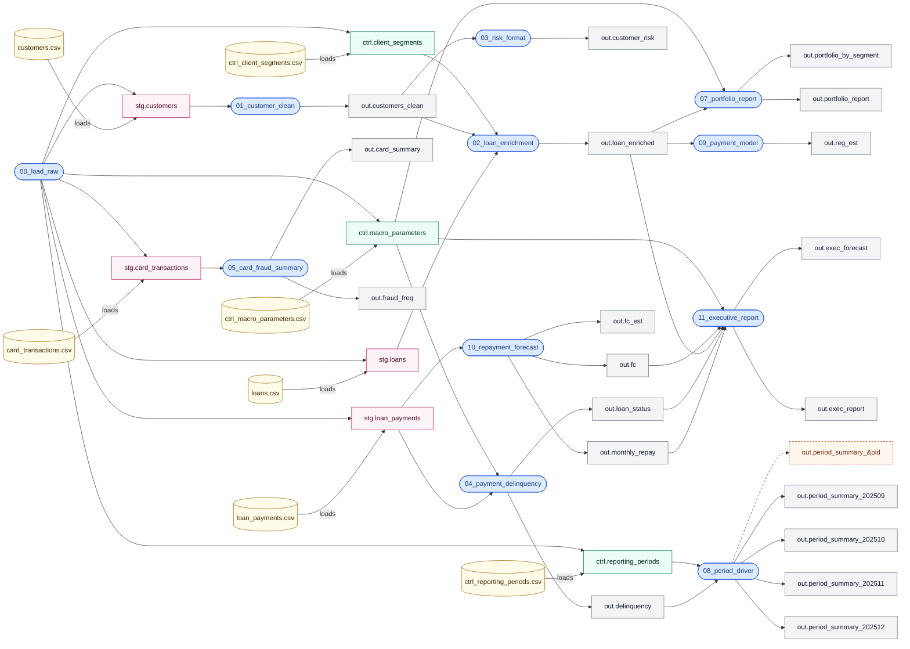
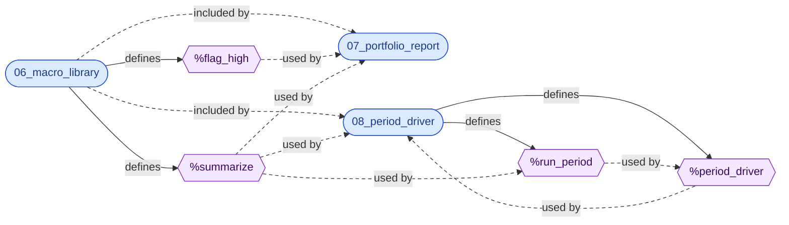
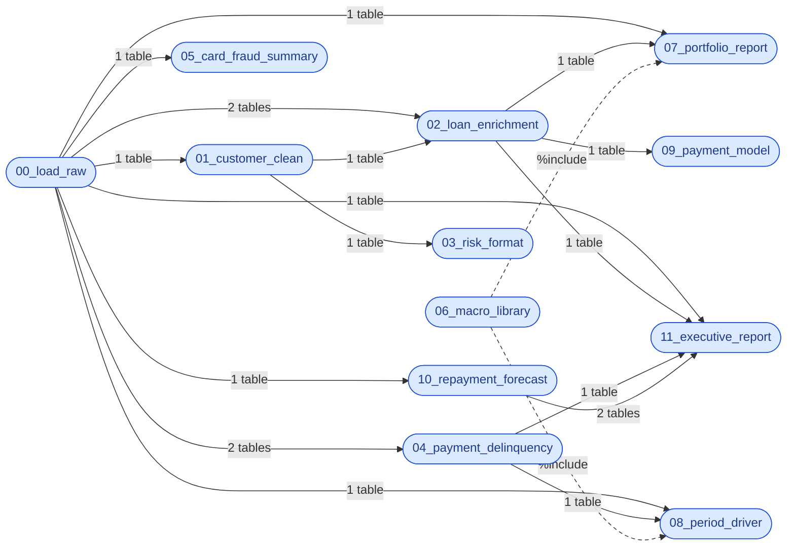

# Lineage: how the SAS programs, tables and files are connected

This page answers two questions about the SAS code in this project:

- **Where does a number come from?** For any result table, which programs produced it, which tables they
  read, and which source files those tables were loaded from.
- **What depends on what?** Which programs must be migrated before others, and which programs share code.

The diagrams are not drawn by hand. `python/analyzer.py` reads the SAS code and records every connection
it finds (for example "program 04 reads table `stg.loan_payments`") in `outputs/lineage_edges.csv`.
`python/lineage_diagram.py` then turns that file into this page. Because the page is regenerated from the
code, it stays correct when a program changes: rerunning `python python/run_all.py` redraws it.

## Two kinds of lineage

In SAS you need to follow two kinds of connections together:

| Kind | The question it answers | Connections recorded |
|---|---|---|
| **Data lineage** | Where did this table's data come from? | a source file is loaded into a table; a program reads a table; a program writes a table |
| **Code lineage** | Which code produced it, including code that lives in another program? | a program pulls in another program with `%include`; a program defines a macro; a program or a macro calls a macro |

Code lineage matters in SAS because two programs can depend on each other without any table between them.
Program 08 writes its summary tables by calling a macro (a reusable block of SAS code) called `%summarize`.
That macro is not written in program 08: it lives in program 06, and program 08 copies it in with
`%include`. Looking only at tables, you would never see that a change to program 06 changes program 08's
results.

In total the analyzer found 53 items (27 tables, 12 programs, 7 files, 4 macros, 3 libraries) and 97 connections between them.

**How sure is each connection?** Every connection has a confidence level, because not every table name
can be read directly from the code:

| Confidence | Meaning | Example |
|---|---|---|
| HIGH | The table name is written literally in the code. | `set stg.loan_payments;` |
| MEDIUM | The name was worked out indirectly: from the arguments of a macro call, or from SAS's MPRINT log, a file in which SAS records the code it actually ran after expanding the macros. | `%summarize(..., out=out.portfolio_by_segment)`; the four `out.period_summary_2025MM` tables in the MPRINT log of program 08 |
| LOW | The name contains a macro variable that is only known when the program runs. | `out.period_summary_&pid` |

## 1. Tracing a result back to its sources

### 1a. Automatically, for a whole table

The script `python/lineage_trace.py` follows the connections backwards from any table. Here is the result
for the executive report (`out.exec_report`), the last table in the chain. Read it from the top: the
report was written by program 11; program 11 read four result tables and one settings table; each of those was
written by an earlier program; and so on until the source CSV files.

Each line shows how the item is connected to the line above it, then its kind and the confidence level.
"(see above)" means the item was already traced higher up, so its sources are not repeated.

```text
$ python python/lineage_trace.py out.exec_report
out.exec_report [table]
└─ written by 11_executive_report [program, HIGH]
   ├─ reads ctrl.macro_parameters [table, HIGH]
   │  ├─ loaded from ctrl_macro_parameters.csv [file, HIGH]
   │  └─ written by 00_load_raw [program, HIGH]
   ├─ reads out.fc [table, HIGH]
   │  └─ written by 10_repayment_forecast [program, HIGH]
   │     └─ reads stg.loan_payments [table, HIGH]
   │        ├─ loaded from loan_payments.csv [file, HIGH]
   │        └─ written by 00_load_raw [program, HIGH] (see above)
   ├─ reads out.loan_enriched [table, HIGH]
   │  └─ written by 02_loan_enrichment [program, HIGH]
   │     ├─ reads ctrl.client_segments [table, HIGH]
   │     │  ├─ loaded from ctrl_client_segments.csv [file, HIGH]
   │     │  └─ written by 00_load_raw [program, HIGH] (see above)
   │     ├─ reads out.customers_clean [table, HIGH]
   │     │  └─ written by 01_customer_clean [program, HIGH]
   │     │     └─ reads stg.customers [table, HIGH]
   │     │        ├─ loaded from customers.csv [file, HIGH]
   │     │        └─ written by 00_load_raw [program, HIGH] (see above)
   │     └─ reads stg.loans [table, HIGH]
   │        ├─ loaded from loans.csv [file, HIGH]
   │        └─ written by 00_load_raw [program, HIGH] (see above)
   ├─ reads out.loan_status [table, HIGH]
   │  └─ written by 04_payment_delinquency [program, HIGH]
   │     ├─ reads ctrl.macro_parameters [table, HIGH] (see above)
   │     └─ reads stg.loan_payments [table, HIGH] (see above)
   └─ reads out.monthly_repay [table, HIGH]
      └─ written by 10_repayment_forecast [program, HIGH] (see above)
```

The same trace as a diagram. The arrows point in the direction the data flows, from the source files on
the left to the report on the right; to trace back, read from right to left.



The script also writes `outputs/lineage_paths.csv`, which lists, for every result table, everything
behind it and how many steps away it is. The Power BI dashboard uses that file: you pick a result table
and it lists all its sources.

### 1b. By hand, for a single number

The automatic trace works at table level. To follow one specific number, you also need to know which columns
each step used, which means reading the code at each step. Here is that trace for one value in the executive
report: **371**, the number of loans in the segment "Particulier Québec" that were ever more than 30 days late.
SAS computed 371, and the PySpark code converted by Claude also gives 371.

| Step | Value or column | Produced by (program and SAS code) | From |
|---|---|---|---|
| 1 | `out.exec_report.n_delinquent_loans` = 371 for "Particulier Québec" | `11_executive_report`: `sum(s.max_dpd > &dpd_threshold) as n_delinquent_loans ... group by e.segment_name` | `out.loan_status.max_dpd`, the macro variable `&dpd_threshold`, `out.loan_enriched.segment_name` |
| 2 | `&dpd_threshold` = `30` (text) | `11_executive_report`: `select param_value into :dpd_threshold from ctrl.macro_parameters where param_name = 'DPD_THRESHOLD'` | `ctrl.macro_parameters` |
| 3 | `ctrl.macro_parameters` | `00_load_raw`: `infile f_par` | `ctrl_macro_parameters.csv`, row `DPD_THRESHOLD,30` |
| 4 | `out.loan_status.max_dpd`: each loan's worst delay | `04_payment_delinquency`: `retain max_dpd; max_dpd = max(max_dpd, days_past_due); if last.loan_id then output out.loan_status` after `proc sort nodupkey` | `stg.loan_payments.days_past_due` |
| 5 | `stg.loan_payments.days_past_due` | `00_load_raw`: `infile f_pay` | `loan_payments.csv`, column `days_past_due` |
| 6 | `out.loan_enriched.segment_name` | `02_loan_enrichment`: `left join ctrl.client_segments as s on c.segment_code = s.segment_code` | `out.customers_clean.segment_code`, `ctrl.client_segments.segment_name` |
| 7 | `out.customers_clean.segment_code` | `01_customer_clean`: copied from `set stg.customers` | `stg.customers` ← `customers.csv` |

If 371 looked wrong, this table says where to look, in order: the `DPD_THRESHOLD` row in the settings table
(steps 2–3), the worst-delay logic and the duplicate removal in program 04 (step 4), the segment join in
program 02 (step 6), or the raw payment file (step 5). That is the practical use of lineage in a migration:
when a migrated number differs, it narrows down which piece of code to fix.

## 2. Data lineage: every file, table and program

The complete picture of how data flows, from the 7 source files on the left to the result tables on the
right. Colours show the kind of table: pink tables hold the loaded source data (`stg`), green tables hold
settings (`ctrl`), grey tables are results (`out`).



## 3. Code lineage: shared code and macros

This diagram leaves the data out and shows only how the code is connected. Macros are the purple
hexagons.

- Program 06 is a library: it defines two macros, `%summarize` and `%flag_high`, and produces no data.
- Programs 07 and 08 copy program 06 in with `%include` and use its macros.
- Program 08 also has macros inside macros: `%period_driver` calls `%run_period`, which calls
  `%summarize` from program 06. That is three levels of nesting, and the last level is in a different file.

An arrow labelled "used by" points from a macro to the program or macro that calls it; "included by"
points from program 06 to the programs that copy it in.



## 4. Migration order

A program can only be tested after the programs whose results it reads have been converted, because it
needs their output as input. An arrow from A to B means B depends on A (the label says how many of A's
tables B reads), so programs on the left are migrated first.



## Legend

| Shape and colour | Meaning |
|---|---|
| Yellow cylinder | a source file (CSV) |
| Blue rounded box | a SAS program |
| Purple hexagon | a SAS macro |
| Rectangle | a SAS table: pink `stg` (loaded source data), green `ctrl` (settings), grey `out` (results) |
| Orange dashed box | a table whose name is only known when the program runs (LOW confidence) |
| Dashed arrow | "included by" (`%include`), "used by" (a macro call), or a LOW-confidence link |

## What this lineage does not cover

- It works at table level: it tells you that program 11 reads `out.loan_status`, not which columns it
  uses. The column-by-column trace in section 1b was done by reading the code.
- It reads the code without running it, plus one log of the code SAS actually ran (MPRINT, for program
  08). SAS code that writes and runs other SAS code on the fly (`CALL EXECUTE`) would be missed.
- It recognises libraries that point to folders (`libname stg "<folder>"`), not libraries that connect
  to a database.
- The diagrams leave out the library nodes and the cases where a program reads a table it has just
  written itself (program 00 re-reads `stg.customers` to check it; program 07 re-reads
  `out.portfolio_by_segment` between two macro calls).
