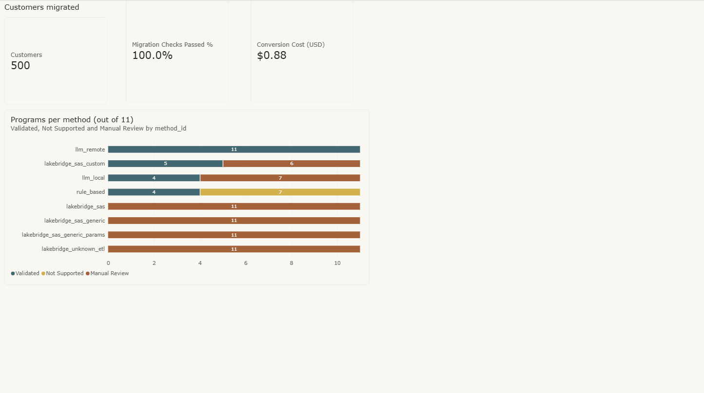
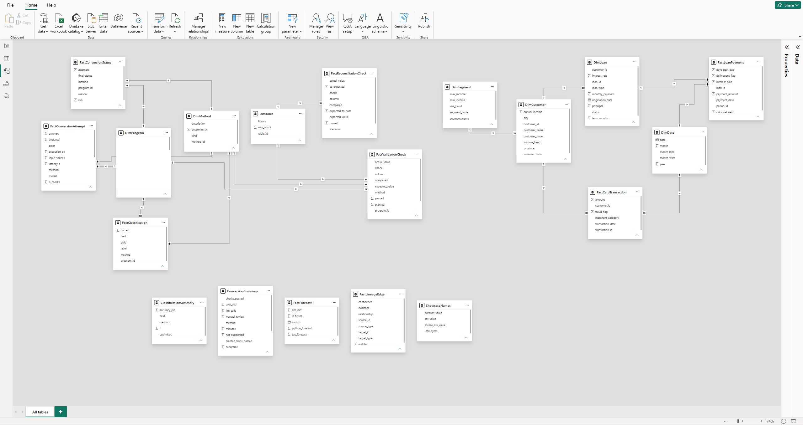

# Power BI dashboard

The dashboard shows the results of the project in one place: how many programs each method converted, which
checks passed, how the data migration went, and how the SAS programs and tables are connected. It is built in
Power BI Desktop from 19 of the 20 CSV files in [`outputs/bi/`](../outputs/bi/), which
[`python/lineage_bi.py`](../python/lineage_bi.py) produces from the project's results. The 20th file, `FactLineagePath`, is ready for a back-trace page
but is not used in the dashboard yet. The `.pbix` file itself is not in this repository.



*The Migration overview page. Screenshots of all 9 pages are listed under [Pages](#pages).*


## The data model



*Model view in Power BI Desktop. Left: the migration results (DimProgram, DimMethod and DimTable with their result tables). Right: the bank's data (DimSegment → DimCustomer → DimLoan → FactLoanPayment, plus FactCardTransaction and DimDate). Bottom: standalone tables without relationships.*

The tables are shaped for Power BI before they are loaded (one row means one clear thing in every table), so
the dashboard only needs relationships and a few simple measures, not heavy transformations. There are two
separate parts.

**The migration results.** Three lookup tables describe the programs, the methods and the SAS tables. The
result tables point to them:

| Lookup table | Result tables that use it | Joined on |
|---|---|---|
| DimProgram (one row per SAS program) | FactClassification, FactConversionAttempt, FactConversionStatus, FactValidationCheck | `program_id` |
| DimMethod (one row per method) | FactClassification, FactConversionAttempt, FactConversionStatus, FactValidationCheck | `method_id` = `method` |
| DimTable (one row per SAS table) | FactReconciliationCheck, FactValidationCheck | `table_id` |

**The bank's data.** This part lets the dashboard show the data the SAS programs work on. Customers belong to
segments, loans belong to customers, and payments belong to loans, so the lookups form a chain: DimSegment →
DimCustomer → DimLoan → FactLoanPayment. Card transactions link to DimCustomer, and both payments and card
transactions link to a date table (DimDate). The loan whose customer (999) does not exist shows up as
"(Blank)", which makes that planted problem visible.

A few tables are used on their own, without relationships: FactLineageEdge, FactForecast,
ShowcaseNames and the two summary tables. All relationships are many-to-one and filter in one direction.

What one row means in each result table:

| Table | One row is |
|---|---|
| FactConversionStatus | one program converted by one method, with its final result |
| FactConversionAttempt | one attempt (one call to a model), with time, tokens, cost and any error |
| FactValidationCheck | one check comparing a converted program's output with SAS |
| FactReconciliationCheck | one check comparing a SAS table with its Parquet copy |
| FactClassification | one label (business area, technical type or complexity) given to one program by one method |
| FactLoanPayment | one loan in one month, after the duplicate was removed (taken from SAS's own output) |
| FactCardTransaction | one card transaction |
| FactForecast | one month, with SAS's forecast, Python's forecast and the difference |
| FactLineageEdge | one connection in the lineage graph, either data (a file loaded into a table, a table read or written by a program) or code (`%include`, a macro defined or called) |
| FactLineagePath (not loaded yet) | one result table together with one item behind it (a program, table, macro or source file) and how many steps away it is |

## Measures

```
Validated          = CALCULATE(COUNTROWS(FactConversionStatus), FactConversionStatus[final_status] = "VALIDATED")
Validation Rate    = DIVIDE([Validated], COUNTROWS(FactConversionStatus))
Checks Passed %    = DIVIDE(SUM(FactValidationCheck[passed]), COUNTROWS(FactValidationCheck))
Migration Checks Passed % = CALCULATE(DIVIDE(SUM(FactReconciliationCheck[passed]), COUNTROWS(FactReconciliationCheck)),
                                      FactReconciliationCheck[expected_to_pass] = 1)
Conversion Cost (USD) = SUM(FactConversionAttempt[cost_usd])
Max Forecast Diff  = MAX(FactForecast[abs_diff])
Late Payment Rate  = AVERAGE(FactLoanPayment[delinquent_flag])
Manual Review      = CALCULATE(COUNTROWS(FactConversionStatus), FactConversionStatus[final_status] = "MANUAL_REVIEW")
Traps Passed %     = DIVIDE(CALCULATE(SUM(FactValidationCheck[passed]), FactValidationCheck[planted] = 1),
                            CALCULATE(DISTINCTCOUNT(FactValidationCheck[check]), FactValidationCheck[planted] = 1,
                                      REMOVEFILTERS(DimMethod), REMOVEFILTERS(FactValidationCheck[method]))) + 0
```

`Migration Checks Passed %` leaves out the three checks that are meant to fail (the deliberately cut-off
names), so it measures only the real migration.

## Pages

| Page | What it shows | Screenshot |
|---|---|---|
| Migration overview | customers migrated, migration checks passed, total conversion cost, and the programs per method: converted (validated), refused (not supported) or failed (manual review) | [view](pages/01_migration_overview.png) |
| Bank data | customers by segment and by income band, loans by type | [view](pages/02_bank_data.png) |
| Repayments and cards | total repayments and late-payment rate by month, card spending by merchant category, total refunds | [view](pages/03_repayments_and_cards.png) |
| Code inventory | the facts the analyzer found about each SAS program, next to its complexity in the answer key | [view](pages/04_code_inventory.png) |
| Rules vs LLM vs gold | classification accuracy per method and label, and every label that differs from the answer key | [view](pages/05_rules_vs_llm_vs_gold.png) |
| Data migration | the four accented showcase names as they appear in the CSV, in SAS and in Parquet, and every migration check (the three deliberately failing truncation checks are highlighted) | [view](pages/06_data_migration.png) |
| Code conversion | the result of every program for every method, SAS's forecast against Python's, the largest forecast difference, and the number of programs each method converted | [view](pages/07_code_conversion.png) |
| Migration risks | the share of the 7 trap checks each method passed (0% means the program never produced output to check) | [view](pages/08_migration_risks.png) |
| Lineage | the network of data and code connections between source files, tables, programs and macros | [view](pages/09_lineage.png) |
